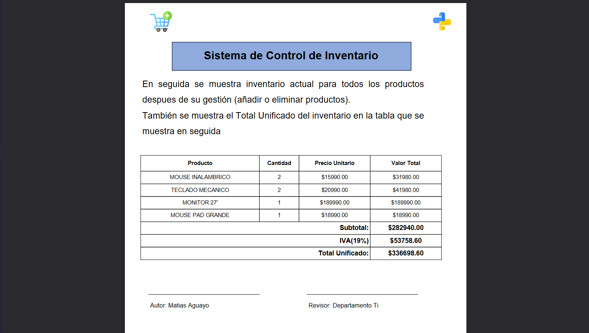

# 🐍 Master-Python-Daxus-Nivel-1

Repositorio oficial de aprendizaje, prácticas, proyectos y Business Case del Nivel 1 del Máster en Python en Daxus Latam.
## Badges

## Features

- **Módulos Fundamentales:** Desde bases de la terminal y configuración de entorno hasta control de flujo y funciones avanzadas.
- **Estructuras de Datos:** Manejo eficiente de Listas, Diccionarios, Tuplas y Conjuntos.
- **Sistema de Gestión Local:** Aplicación de consola modular con validaciones robustas y operaciones CRUD completas.
- **Business Case Automatizado:** Generación de fichas de acompañamiento y reportes formales exportados a formato PDF.

## Tech Stack

* **Lenguaje:** Python 3.x
* **Entorno de Desarrollo:** Visual Studio Code (VS Code)
* **Control de Versiones:** Git y GitHub

## Acknowledgements

* **Institución:** Daxus Latam (Máster en Python - Nivel 1)
* **Enfoque:** Desarrollo de lógica de programación, automatización y casos de negocio reales orientados al sector profesional.

## 📊 Vista Previa del Business Case (Reporte PDF)
